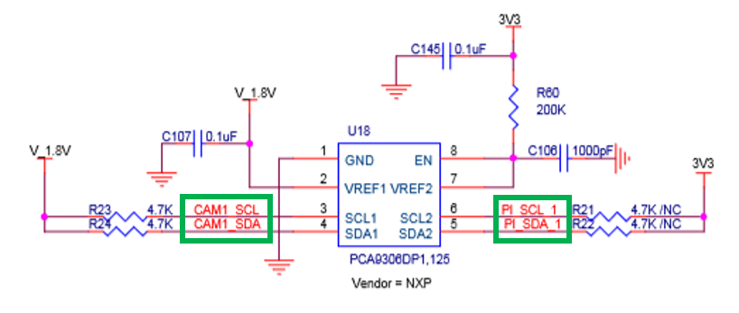
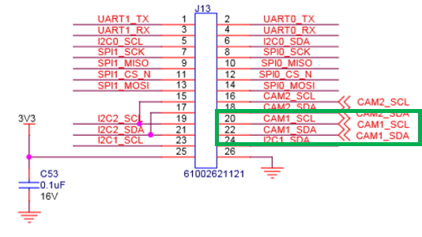
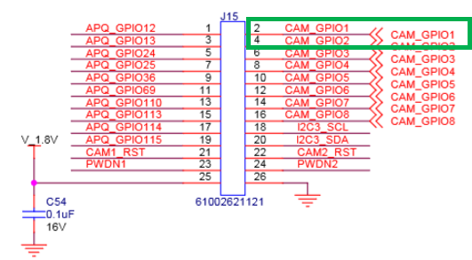
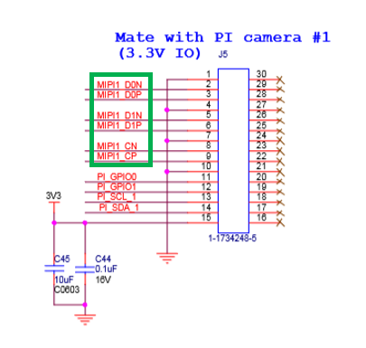
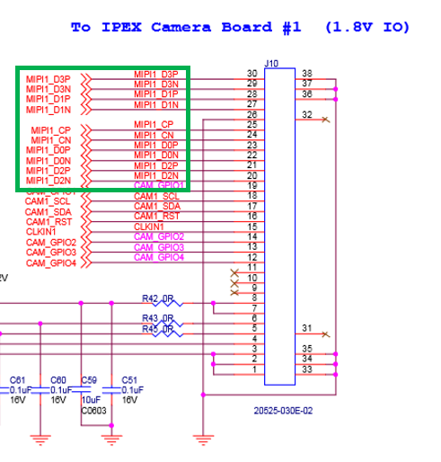
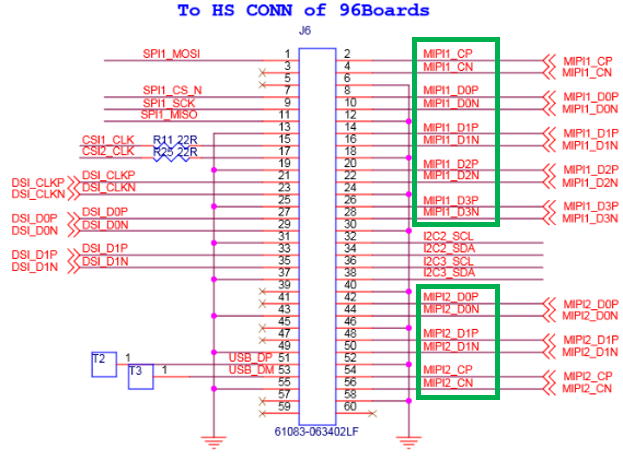
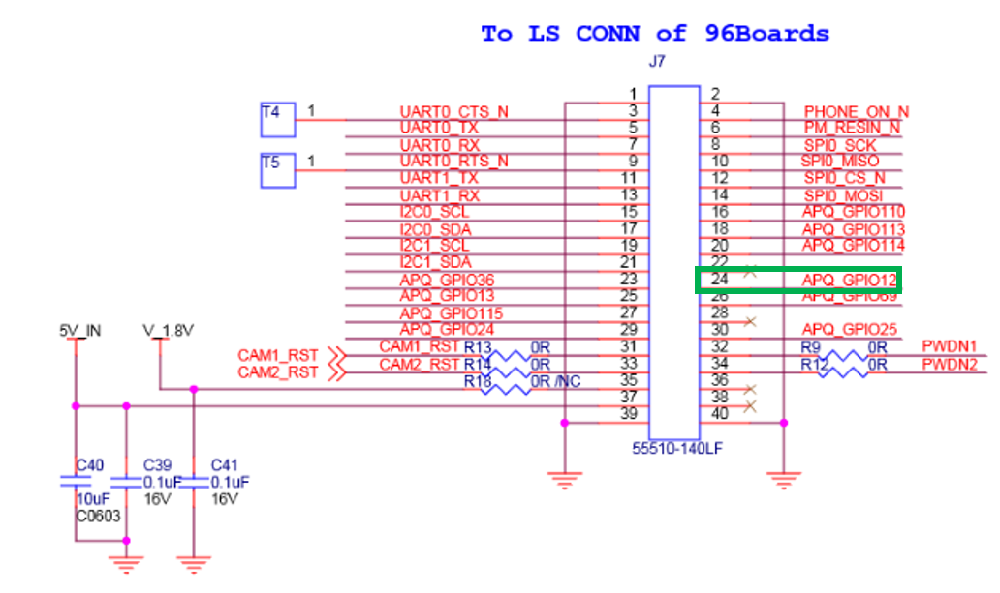

# 96Baords MIPI adapter

## [40pin LS CONN]-[CONN]-[J15]
### To Ultra96 PS GPIO
- [J7-23]-[APQ_GPIO36]-[J15-9]
- [J7-24]-[APQ_GPIO12]-[J15-1]
- [J7-25]-[APQ_GPIO13]-[J15-3]
- [J7-26]-[APQ_GPIO69]-[J15-11]
- [J7-27]-[APQ_GPIO115]-[J15-19]
- [J7-28]-×

## semantics

