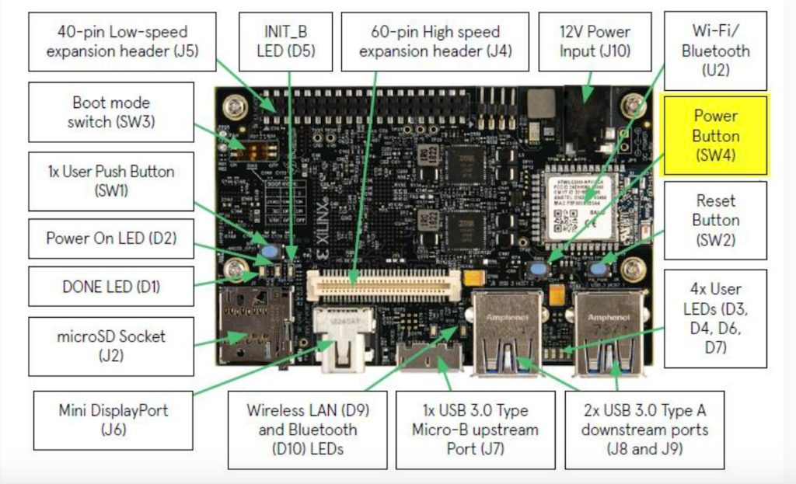

# studyGPIO
## シリアル通信
### SPI通信
デバイス同士の接続によく利用される同期式シリアル通信。4つの信号線を使う。
- SIMO: マスターモード時は出力ピン、スレーブモード時は入力ピン
- SOMI: マスターモード時は入力ピン、スレーブモード時は出力ピン
- SCLK: マスターモード時はクロック出力ピン、スレーブモード時はクロック入力ピン
- SS: マスターが複数あるスレーブ機器のうち通信したいスレーブ機器のSS端子をLowに制御して通信する。スレーブ端子が1つしかない場合はLow固定でOK。
### I2C通信
デバイス同士の接続によく利用される同期式シリアル通信。速度はSPI通信に劣るが、2本の信号線で接続する。
- SDA: データ通信用。
- SCL: クロック信号用。マスター側がスレーブ側に出力する。
### UART
デバイス同士の接続によく利用される非同期シリアル通信。2つの信号線で接続する。
- TXD: データ送信用
- RXD: データ受信用
また、さらに2つの信号線を用いてハードウェアフロー制御を行うこともできる。
- RTS: 送信要求信号
- CTS: 送信可信号

## MIPI
モバイルデバイス用に設計された業界仕様の標準規格。D=PHY, C-PHY, M-PHYの3つの共通独自物理レイヤを定義。高速通信用のHSモードおよび少電力用のLSモードがある。
###　MIPI D-PHY
最初に登場した物理層でモバイルデバイスのカメラやモニタで一般的に使用される。データ信号とクロック信号を別に伝送する。データ信号数に規定はないが、データ信号線4対・クロック信号線1対の信号線合計10本を利用するのが典型的。

### MIPI M-PHY
D-PHYよりも高速な後継規格で、クロック信号およびデータ信号を重畳して伝送する。D-PHYから物理層を大幅に刷新するコストが高いなどの理由でまだ普及していない。

### MIPI C-PHY
D-PHYの物理層を流用しながら高速化および低コスト化を図ったのがC-PHYである。D-PHYと同じ信号線数でデータ伝送速度をおよそ1.5倍にすることができる。クロック信号およびデータ信号を重畳して伝送する。
送信ICは1レーンあたり3本の信号線(Va, Vb, Vc)を使用。受信IC側は3本の信号線の差動電圧(Va-Vb, Vb-Vc, Vc-Va)を検知。

## GPIOの概要
GPIOはGeneral Purpose Input/Outputの略で、汎用I/Oポートとも呼ばれる。以下の特徴がある。
- ユーザー側から制御可能
- 入出力に使える
- 有効/無効の切り替え可能
- 入力割り込み機能


## Ultra96-V2の入出力配置
Ultra96-V2の入出力は以下のように配置されている。ユーザー用ブッシュボタンにUser Push Button(SW1)が用意されている。また、様々なLEDが用意されている。   


## Ultra96-V2のハードウェアユーザガイド
[HW User Guide](Ultra96-V2-HW-User-Guide-v1_3.pdf)より以下がわかる。
### プッシュボタンスイッチ
ユーザーが利用可能なプッシュボタンは以下の通り。
- PS MIO Bank 500(1.8V, MIOs 0 to 25)
	- MIO23 Push Button(SW1)
		- MPSoC Pin Number: AB5
		- MPSoC Site Name: PS_MIO23_500
		- Ultra96-V2 Net name: MIO23_GPIO_PB
### LED
ユーザーが利用可能なLEDは以下の通り。
- Four user-controllable LEDs connected to PS_MIO[17..20]
	- PS LEDs
		- MPSoC Pin Number: AB4
		- Bank: 500
		- MPSoC Site Name: PS_MIO20_500
		- Ultra96-V2 Net name: MIO20_PS_LED0
		- MPSoC VCCO: +VCC_PSAUX = 1.8V
		- Color: Green
	- PS LEDs
		- MPSoC Pin Number: AA4
		- Bank: 500
		- MPSoC Site Name: PS_MIO19_500
		- Ultra96-V2 Net name: MIO19_PS_LED1
		- MPSoC VCCO: +VCC_PSAUX = 1.8V
		- Color: Green
	- PS LEDs
		- MPSoC Pin Number: Y5
		- Bank: 500
		- MPSoC Site Name: PS_MIO18_500
		- Ultra96-V2 Net name: MIO18_PS_LED2
		- MPSoC VCCO: +VCC_PSAUX = 1.8V
		- Color: Green
	- PS LEDs
		- MPSoC Pin Number: AA3
		- Bank: 500
		- MPSoC Site Name: PS_MIO17_500
		- Ultra96-V2 Net name: MIO17_PS_LED3
		- MPSoC VCCO: +VCC_PSAUX = 1.8V
		- Color: Green
- User-controllable Radio status connected to PL Pin B9/A9
	- Radio LEDs
		- MPSoC Pin Number: A9
		- Bank: 26
		- MPSoC Site Name: IO_L9N_AD3N_26
		- Ultra96-V2 Net name: RADIO_LED0
		- MPSoC VCCO: +VCC_AUX = 1.8V
		- Color: Yellow
	- Radio LEDs
	- Radio LEDs
		- MPSoC Pin Number: B9
		- Bank: 26
		- MPSoC Site Name: IO_L9P_AD3P_26
		- Ultra96-V2 Net name: RADIO_LED1
		- MPSoC VCCO: +VCC_AUX = 1.8V
		- Color: Blue
		
### Bluetooth   
The ATWILC300-MR110CA Bluetooth interface connects through a UART interface. Since the Bluetooth UART interface requires hardware flow-control (RTS/CTS), which is only available through the PL, the UART RX/TX signals are connected to PS UART0 (MIO2, MIO3) and the RTS/CTS signals are connected to the PL High-Density (HD) bank. A blue LED is connected to Bank 26 programmable logic and can be used to indicate that Bluetooth is enabled when configured properly.
- Bluetooth
	- MPSoC Pin Number: B5
	- Bank: 26
	- MPSoC Site Name: IO_L11N_AD1N_26
	- Ultra96-V2 Net Name: BT_HCI_CTS
	- MPSoC VCCO: +VCC_AUX = 1.8V
- Bluetooth
	- MPSoC Pin Number: B7
	- Bank: 26
	- MPSoC Site Name: IO_L12P_AD0P_26
	- Ultra96-V2 Net Name: BT_HCI_RTS
	- MPSoC VCCO: +VCC_AUX = 1.8V

### GPIO
#### PL 

### 40 Pin Low Speed Expansion Connector (J5)
Ultra96-V2 provides a 96Boards compatible Low Speed Expansion Connector. A Molex
87381-4063 (or compatible) 40 pin low profile female 2mm receptacle (20x2) 4.5mm height
is specified.
Table 24 shows the pinout of the Low Speed Expansion Header (Ultra96-V2 column) and
the differences from the 96Boards specification (96Boards column). Except for I2C0 and
I2C1, all dedicated interfaces specified by 96Boards can be replaced with GPIO or any
other IP supported by Zynq UltraScale+.
- PS MIO Bank 501 (GPIO)
	- PS_MIO36
		- MPSoC Pin Number: D10
		- MPSoC Site Name: PS_MIO36_501
		- Ultra96-V2 Net name: MIO36_PS_GPIO1_0
		- Connects to: J5-23
	- PS_MIO37
		- MPSoC Pin Number: E11
		- MPSoC Site Name: PS_MIO37_501
		- Ultra96-V2 Net name: MIO37_PS_GPIO1_1
		- Connects to: J5-24
	- PS_MIO39
		- MPSoC Pin Number: C10
		- MPSoC Site Name: PS_MIO39_501
		- Ultra96-V2 Net name: MIO39_PS_GPIO1_2
		- Connects to: J5-25
	- PS_MIO40
		- MPSoC Pin Number: D11
		- MPSoC Site Name: PS_MIO40_501
		- Ultra96-V2 Net name: MIO40_PS_GPIO1_3
		- Connects to: J5-26
	- PS_MIO44
		- MPSoC Pin Number: B11
		- MPSoC Site Name: PS_MIO44_501
		- Ultra96-V2 Net name: MIO44_PS_GPIO1_4
		- Connects to: J5-27
	- PS_MIO45
		- MPSoC Pin Number: A11
		- MPSoC Site Name: PS_MIO45_501
		- Ultra96-V2 Net name: MIO45_PS_GPIO1_5
		- Connects to: J5-28
- HD PL IO Bank 26 (1.8V) (GPIO)
	- HD_GPIO0
		- MPSoC Pin Number: D7
		- MPSoC Site Name: IO_L5P_HDGC_AD7P_26
		- Pin: 3
	- HD_GPIO1
		- MPSoC Pin Number: F8
		- MPSoC Site Name: IO_L4P_AD8P_26
		- Pin: 5
	- HD_GPIO2
		- MPSoC Pin Number: F7
		- MPSoC Site Name: IO_L4N_AD8N_26
		- Pin: 7
	- HD_GPIO3
		- MPSoC Pin Number: G7
		- MPSoC Site Name: IO_L2P_AD10P_26
		- Pin: 9
	- HD_GPIO4
		- MPSoC Pin Number: F6
		- MPSoC Site Name: IO_L2N_AD10N_26
		- Pin: 11
	- HD_GPIO5
		- MPSoC Pin Number: G5
		- MPSoC Site Name: IO_L1N_AD11N_26
		- Pin: 13
	- HD_GPIO6
		- MPSoC Pin Number: A6
		- MPSoC Site Name: IO_L12N_AD0N_26
		- Pin: 29
	- HD_GPIO7
		- MPSoC Pin Number: A7
		- MPSoC Site Name: IO_L10N_AD2N_26
		- Pin: 31
	- HD_GPIO8
		- MPSoC Pin Number: G6
		- MPSoC Site Name: IO_L1P_AD11P_26
		- Pin: 33
	- HD_GPIO9
		- MPSoC Pin Number: E6
		- MPSoC Site Name: IO_L3P_AD9P_26
		- Pin: 16
	- HD_GPIO10
		- MPSoC Pin Number: E5
		- MPSoC Site Name: IO_L3N_AD9N_26
		- Pin: 18
	- HD_GPIO11
		- MPSoC Pin Number: D6
		- MPSoC Site Name: IO_L5N_HDGC_AD7N_26
		- Pin: 20
	- HD_GPIO12
		- MPSoC Pin Number: D5
		- MPSoC Site Name: IO_L7P_HDGC_AD5P_26
		- Pin: 22
	- HD_GPIO13
		- MPSoC Pin Number: C7
		- MPSoC Site Name: IO_L8N_HDGC_AD4N_26
		- Pin: 30
	- HD_GPIO14
		- MPSoC Pin Number: B6
		- MPSoC Site Name: IO_L11P_AD1P_26
		- Pin: 32
	- HD_GPIO15
		- MPSoC Pin Number: C5
		- MPSoC Site Name: IO_L7N_HDGC_AD5N_26
		- Pin: 34

- GND
	- Pin:1
	- Pin:2
	- Pin: 39
	- Pin: 40
- Power
	- +1V8
		- 1.8V
		- Pin: 35
	- +5V0
		- 5.0V
		- Pin: 37

		
## GPIOの使用方法
### PS側GPIOの使用方法
Vivadoでの接続作業は特に必要ない。
以下はMIO36_PS_GPIO1_0 (J5-23)を操作する場合の例。
```
// 制御フォルダの作成
sudo sh -c 'echo "36" > /sys/class/gpio/export'
// 出力時(LED等)
sudo sh -c 'echo "out" > /sys/class/gpio/gpio36/direction'
sudo sh -c 'echo "0" > /sys/class/gpio/gpio36/value'
sudo sh -c 'echo "1" > /sys/class/gpio/gpio36/value'
// 入力時(スイッチ等)
sudo sh -c 'echo "in" > /sys/class/gpio/gpio36/direction'
cat /sys/class/gpio/gpio36/value
> 0 or 1
//　制御フォルダの削除
sudo sh -c 'echo "36" > /sys/class/gpio/unecport'
```


### PL側GPIOの使用方法
VivadoでAXI GPIOを経由してExternal Pinと接続する。制御方法はAXI GPIOの使い方を記載した以下のページを参照。
- https://japan.xilinx.com/content/dam/xilinx/support/documentation/ip_documentation/axi_gpio/v2_0/pg144-axi-gpio.pdf
- https://github.com/Xilinx/embeddedsw/tree/master/XilinxProcessorIPLib/drivers/gpio/examples
- https://xilinx-wiki.atlassian.net/wiki/spaces/A/pages/18841846/AXI+GPIO
- https://qiita.com/s_nkg/items/800e0559332495605056
- https://taltalp.hatenablog.jp/entry/2017/11/06/204748
- https://dora.bk.tsukuba.ac.jp/~takeuchi/?%E9%9B%BB%E6%B0%97%E5%9B%9E%E8%B7%AF%2Fzynq%2FPetalinux2018.3%E3%81%A7axi_gpio

	
## Ultra96-V2の参考資料
- [Ultra96-V2 image](ultra96v2.png)
- [HW User Guide](Ultra96-V2-HW-User-Guide-v1_3.pdf)
- [Scemantic](Ultra96-V2_Rev1_Schematic.pdf)
- [constraints of AVNET reference file](Ultra96_V2_constraints_190430.xdc)
